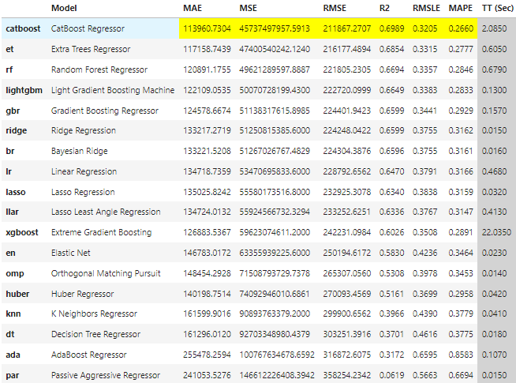
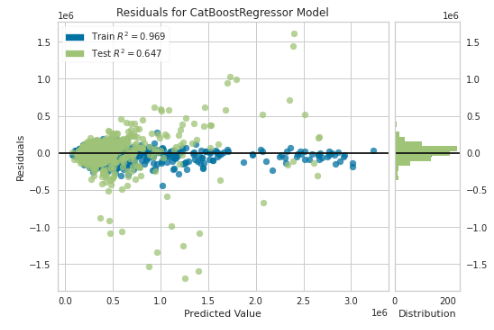

# API deployment

- Repository: `challenge-machine-learning-api-deployment`
- Type of Challenge: `Learning`
- Duration: `6 days`
- Deadline: `05/05/2022 04:30 PM` **(code)**
- Presentation: `06/05/2022 1:30 PM`
- Team challenge : Solo project

## Mission objectives

- Be able to deploy a machine learning model.
- Be able to create a Flask API that can handle a machine learning model.
- Deploy an API to Heroku.

## The Mission

The real estate company "ImmoEliza" is really happy about your data collection using web scrapping. Whenever a new property comes on the market, the question of how it should be priced naturally arises.

Now, the company asks you to create a machine learning model to predict prices on Belgium's real estate sales. "ImmoEliza" has hired you to build a tool that enables the company to predict property prices using linear regression.  

Take the dataset that was previously **scraped** and preprocess the data to be used with machine learning. 

In addition, they would like you to create an API to let their web-developers create a website around it.

Ideally, your API would ask a user to provide with information about a property (features) and return the estimated price using your model.


### Built With

* [Python](https://www.python.org/)
* [Flask](https://flask.palletsprojects.com/)
* [pycaret](https://pycaret.org/)
* [Catboost](https://catboost.ai/)
* [Scikit-learn](https://scikit-learn.org/)
* [Docker](https://www.docker.com/)
* [Heroku](https://www.heroku.com/)

### Prediction Form web page

https://apartmentprice.herokuapp.com/


## Repo Architecture 

```

│   README.md                     : This file
│   app.py                        : Flask app start
│   Dockerfile                    : Docker file  
│   Procfile                      : Heroku start application- gunicorn
│   docker-compose.yml            : Docker file
|   requirements.txt              : Requirements file
|___             
│   houseimpute                   : House data folder 
│   │ model.ipynb                 : Imputations of missing values, Model and test  
│___   
|    model          
│   │ modelapt.ipynb              : Model creation and test.
│   │ clf.pkl                     : Regresser dump file 
│___  
|    preprocessing
│   | cleaningdata.ipynb          : Preliminary check and cleaning of raw data 
│___  
|    templates
│   | website.html                : Template for flask  


```

### Input Data / Feature Names
```
['subtype',
 'age',
 'bedroomCount',
 'bathroomCount',
 'netHabitableSurface',
 'toiletCount',
 'transaction.certificates.epcScore',
 'building.condition',
 'kitchen.type',
 'flags.isNewlyBuilt',
 'hasBasement',
 'hasDressingRoom',
 'hasDisabledAccess',
 'hasLift',
 'hasArmoredDoor',
 'hasVisiophone',
 'hasSecureAccessAlarm',
 'fireplaceExists',
 'hasTerrace',
 'transaction.sale.isFurnished',
 'specificities.hasOffice',
 'hasparking']
```

### CatBoostRegressor
Model Parameters:
```
{'iterations': 1000, 'learning_rate': 0.0396099984645843, 'depth': 6, 'l2_leaf_reg': 3, 'model_size_reg': 0.5, 
'rsm': 1, 'loss_function': 'RMSE', 'border_count': 254, 'feature_border_type': 'GreedyLogSum', 'nan_mode': 'Min', 
'leaf_estimation_iterations': 1, 'leaf_estimation_method': 'Newton', 'random_seed': 10, 'use_best_model': False, 
'best_model_min_trees': 1, 'verbose': False, 'random_strength': 1, 'eval_metric': 'RMSE', 'boosting_type': 'Plain', 
'task_type': 'CPU', 'bootstrap_type': 'MVS', 'subsample': 0.800000011920928, 'sampling_frequency': 'PerTree', 
'sparse_features_conflict_fraction': 0, 'grow_policy': 'SymmetricTree', 'min_data_in_leaf': 1, 'max_leaves': 64, 
'score_function': 'Cosine', 'leaf_estimation_backtracking': 'AnyImprovement', 'penalties_coefficient': 1, 
'model_shrink_rate': 0,'model_shrink_mode': 'Constant', 'posterior_sampling': False, 'boost_from_average': True}
```

### Output

Predicted price: same page as app form
 
### Preperation
 - Appartment prices are used starting from 200K to 400K 
 - datafile was already clean from the previous project but needed to choose some categories and ordinal values.
 - [Catboost](https://catboost.ai/) regressor is used after checking the best fit with [pycaret](https://pycaret.org/)
 - Model has %50 accuracy

## Extras
  In houseimpute folder there is a jupyter book, model.ipynb for House price prediction(not the apartments). 
  But in Belgium the land size house sitting on is effecting the price too much.
  Especially if it has extra building rights on the same land. I cleaned the house data and come up with around 2500 houses and try to grab some reliable data. 
  Building condition, kitchen type and EPC certification scores are used as ordinal data. With some iterative imputing I could also managed to fix room and bedroom
  counts. With ExtraTreeRegressor and CatBoostregressor I could get %70-%75 accuracy.
  CatBoostRegressor was the best fit.

  .


  Data included in the model:  
  ```
  ['transaction.sale.price','flags.isNewlyBuilt','property.subtype','property.bedroomCount','property.bathroomCount','property.netHabitableSurface',
      property.hasBasement','property.hasDressingRoom','property.building.condition','property.building.constructionYear','property.hasCaretakerOrConcierge',
      'property.hasDisabledAccess','property.hasLift','property.kitchen.type','property.land.surface','property.hasLaundryRoom','property.hasGarden',
      'property.parkingCountIndoor','property.parkingCountOutdoor','property.hasAirConditioning','property.hasArmoredDoor','property.hasVisiophone',
      'property.hasSecureAccessAlarm','property.hasCableTV','property.hasDoorPhone','property.showerRoomCount','property.toiletCount',
      'property.hasSwimmingPool','property.hasSauna','property.hasJacuzzi','property.fireplaceExists','property.hasTerrace',
      'transaction.certificates.epcScore','property.energy.hasHeatPump','property.energy.hasPhotovoltaicPanels','property.energy.hasThermicPanels',
      'property.energy.hasCollectiveWaterHeater','property.energy.hasDoubleGlazing','property.livingRoom.surface'
  ]
  ```

After trying to clean for a long time I still had residulas. 
.


### For future
If I can have some cadastral data like how much of the land house has and how much of it is buildable (not a farm nor garden) I could increase accuracy. For location data I tried to divide all Belgium to 500X500 on mercator style. From longtitude and latitude. Unfortunately I did not have enough data to be able to get a percentage of the house price increase or decrease on specific location. I could add it in the model to reflect all Belgium or when a prediction is requested it can be applied to requested location result.  


## Installation & Usage
Apartment price prediction:
https://apartmentprice.herokuapp.com/

```
Clone the repo, 
install requirements:
$ pip install -r requirements.txt
Ready to be dockerized
Push to Heroku as a container
(for pycaret it can be better to use on kaggle, 
it has some conflicts with python 10.xx versions
it is not in the requirements file)
```

